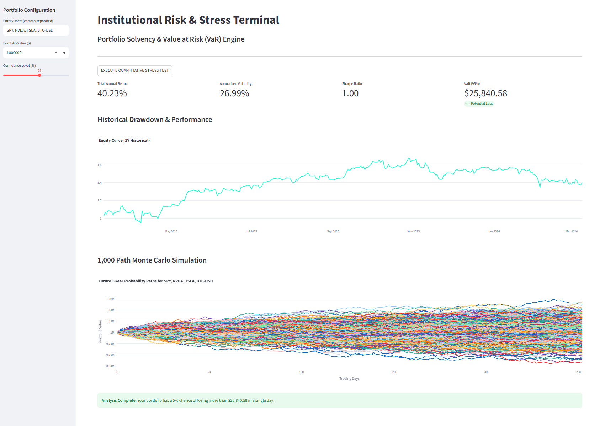

# Institutional Risk Terminal — Portfolio Risk & Stress Engine

## What this is
Institutional Risk Terminal is an interactive portfolio risk dashboard built with Streamlit.
It analyzes historical portfolio performance and estimates potential future losses using Value at Risk (VaR) and Monte Carlo simulation.

The tool demonstrates how institutional portfolio managers evaluate risk exposure,
volatility, and downside probability under uncertain market conditions.

## Data
- Market prices: Yahoo Finance API (via yfinance).
- Assets supported: equities, ETFs, and crypto (e.g., SPY, QQQ, TSLA, BTC-USD).

## Methods
1. Retrieve historical asset prices.
2. Compute daily returns for each asset.
3. Construct equal-weight portfolio returns.
4. Estimate performance statistics (return, volatility, Sharpe ratio).
5. Estimate Value at Risk (VaR) using empirical return distributions.
6. Generate 1,000-path Monte Carlo simulation using Geometric Brownian Motion.

## How to run
py -m pip install -r requirements.txt

py -m streamlit run app.py

## Example Output

Interactive dashboard displaying:

- Portfolio annual return
- Annualized volatility
- Sharpe ratio
- Daily Value at Risk estimate
- Historical equity curve
- Monte Carlo simulation of future portfolio values

## Terminal Interface & Output
Below is a sample execution of the **Alpha-Macro Engine** performing a 1,000-path stochastic projection and historical drawdown analysis.

### Key Analytical Views:
* **Equity Curve:** Real-time backtesting of portfolio returns over a 12-month horizon.
* **Monte Carlo Probability Cone:** 1,000 independent price paths generated via Geometric Brownian Motion.
* **Risk Matrix:** Live calculation of Sharpe Ratio and Parametric Value at Risk (VaR).